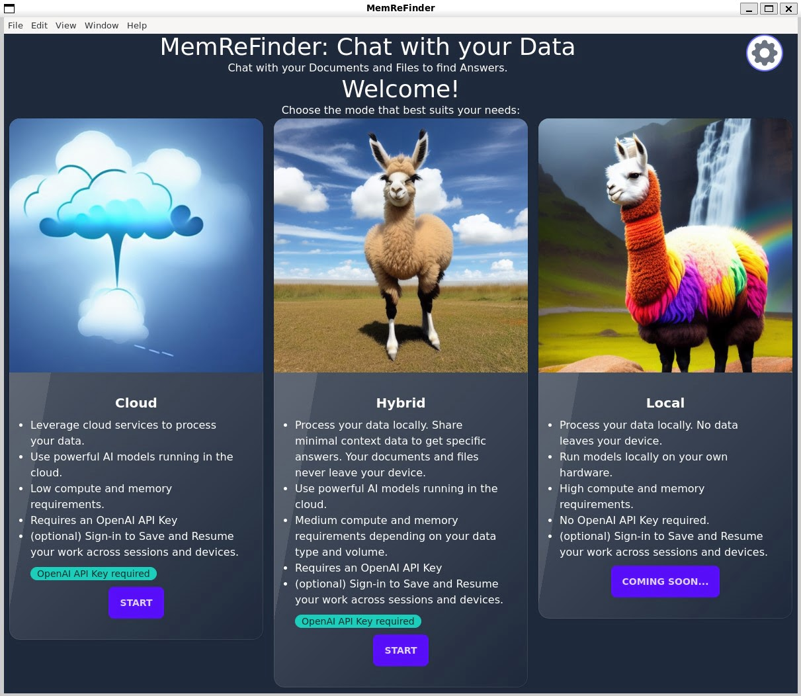

# MemReFinder: Chat with your Documents and Files

Memory and Retrieval-Augmented Finder (File Explorer) App to chat with your data to find answers powered by OpenAI GPT models. You can load multiple DOCX, PDF, CSV, Markdown, HTML or other text files and ask questions related to their content, and the app will use embeddings and GPT to generate answers from the most relevant files and sections within your files.

https://user-images.githubusercontent.com/4770482/232273659-4fa80c21-7ebd-4894-bcb5-68610951b7c9.mp4

You can run the App on your Mac/Windows/Linux Desktop/Laptop or your web browser.

## How does it help you?

- Find answers to your personal or business questions on data that is not public or available to ChatGPT
- Use your personal/organizational/private files locally to find answers to questions
- Build your own knowledge base and ask questions to it
- Empowers you and your files with the power of GPT-3.5+

## Run the App

### Cloud / Hybrid

If you want to avoid uploading your files to a third-party server for processing, you can easily run the app locally. Setup your `OPENAI_API_KEY` securely using a local environment variable and run the app. You can create a new API key [here](https://beta.openai.com/account/api-keys).
Download the latest release for your OS. Portable versions are available for Windows and Linux which do not require installation.

<!-- ASSETS_START -->
### Download links

| Platform       | Download |
| -------------- | -------- |
| Windows        | [Download .exe](https://github.com/praveen-palanisamy/MemReFinder/releases/download/v0.0.2/MemReFinder-Setup-0.0.2.exe) |
| Mac            | [Download .dmg](https://github.com/praveen-palanisamy/MemReFinder/releases/download/v0.0.2/MemReFinder-0.0.2.dmg) |
| Linux          | |
| &emsp;Debian/Ubuntu | [Download .deb](https://github.com/praveen-palanisamy/MemReFinder/releases/download/v0.0.2/memrefinder_0.0.2_amd64.deb) |
| &emsp;AppImage      | [Download .appimage](https://github.com/praveen-palanisamy/MemReFinder/releases/download/v0.0.2/MemReFinder-0.0.2.AppImage) |
| &emsp;RPM-based     | [Download .rpm](https://github.com/praveen-palanisamy/MemReFinder/releases/download/v0.0.2/memrefinder-0.0.2.x86_64.rpm) |
<!-- ASSETS_END -->

See [Releases](https://github.com/praveen-palanisamy/MemReFinder/releases) for download links to other platforms.

## Requirements

To use the app, you need an OpenAI API key. You can create a new API key [here](https://beta.openai.com/account/api-keys).

## Development

### Set Up

0. Install NodeJS [https://nodejs.org/en/download/](https://nodejs.org/en/download/). Recommended to use NVM.
1. Clone the repo
2. Install dependencies: `npm install`
3. Copy the .env.local.example file into a .env.local file and fill out the OpenAI API key field.
4. Run the development server: `npm run dev`
5. Open [http://localhost:3000](http://localhost:3000) with your browser to see/debug the app.
6. Make your changes and submit a PR!
